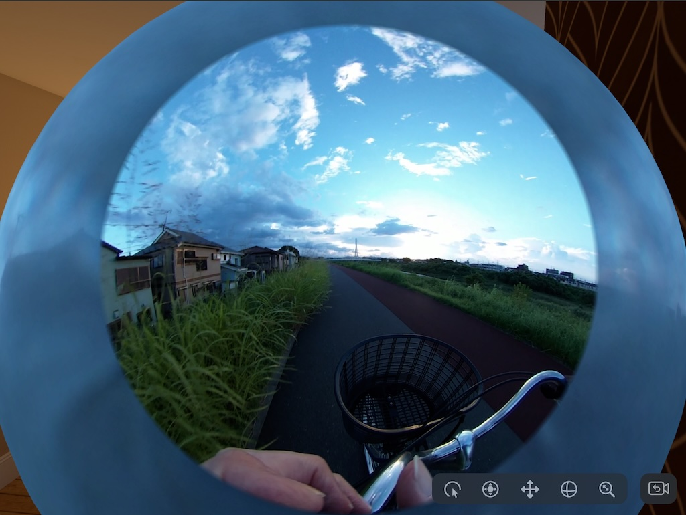
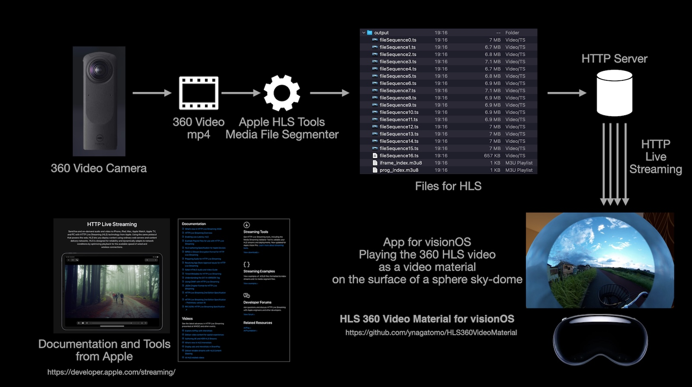

# HLS 360 Video Material for visionOS

A sample project that shows how to use a video material with a HTTP Live Streaming (HLS) 360 video in visionOS.

- Build: Xcode 16.0 beta 6, macOS 15.1 beta
- Target: visionOS 2.0+ (Device or Simulator)

The sample 360 video was captured with the Theta 360 camera and converted to HLS format with Apple HLS tool.
The HLS files are hosted by GitHub Pages as a HTTP server.
This visionOS app plays the streaming video on the surface of the sphere sky-dome.





## Use your 360 videos

1. Shoot 360 videos with your favorite capture device such as Theta, Insta 360. (I'm using Theta.)
1. Convert mov/mp4/m4v files you captured to HLS format files, using Apple HLS Tool, Media File Segmenter.
    - You need to install the Apple HLS Tools. See the Apple HTTP Live Streaming page [Web](https://developer.apple.com/streaming/).
1. Store the HLS files on any HTTP server.
1. Change the URL of your HTTP server in the ImmersiveView.swift.

### Convert

```bash
% mediafilesegmenter -f ./output -t 1  R0010062.MP4
% ls output
fileSequence0.ts    fileSequence12.ts    fileSequence16.ts    fileSequence5.ts    fileSequence9.ts
fileSequence1.ts    fileSequence13.ts    fileSequence2.ts    fileSequence6.ts    iframe_index.m3u8
fileSequence10.ts    fileSequence14.ts    fileSequence3.ts    fileSequence7.ts    prog_index.m3u8
fileSequence11.ts    fileSequence15.ts    fileSequence4.ts    fileSequence8.ts
```

Options:

- `-f <path> | --file-base=<path>       : Path at which to store index and media files`
- `-t <dur>  | --target-duration=<dur>  : Target duration for each segment` (default: 10)

Media File Segmenter:

<blockquote>
Media File Segmenter (mediafilesegmenter) divides a transport stream input or file — such as an MOV, MP4, M4V, M4A, or MP3 — into media segments, creates a media playlist, and can also perform segment encryption. You can deploy the media playlist and media segments using almost any web server infrastructure for streaming to iOS, macOS, and tvOS. The Media File Segmenter only produces Video-on-Demand (VOD) streams.</blockquote>
(Apple Article: [Using Apple’s HTTP Live Streaming (HLS) Tools](https://developer.apple.com/documentation/http-live-streaming/using-apple-s-http-live-streaming-hls-tools))

### Place HLS files on the server

Place the files in the `output` folder on any HTTP server.

### Change URL in the `ImmersiveView.swift` to your content's URL.

```swift
let url = URL(string: "https://your_http_server/prog_index.m3u8")!
```

## Use Local HTTP Server on macOS

You may have many 360 videos of skiing, snowboarding, biking, scuba diving, etc.

By running your Mac as an HTTP Server and streaming contents from your Mac to AVP,
you can easily enjoy them at home without copying files.

### Check the HTTP Server on macOS

The macOS has an Apache HTTP Server (httpd) by default.
You can server several files in the document root folder.

```bash
% which httpd                         # Existence confirmation
/usr/sbin/httpd                       # - httpd: Apache http server
% which apachectl                     # Existence confirmation
/usr/sbin/apachectl                   # - apachectl: Control program
% /usr/sbin/httpd -version            # Check httpd Version
Server version: Apache/2.4.59 (Unix)
Server built:   Jul 31 2024 04:12:39
% cat /etc/apache2/httpd.conf | grep DocumentRoot    # Check the document root
 :
DocumentRoot "/Library/WebServer/Documents"          # /Library/WebServer/Documents
 :
```

### Allow HTTPD Full Disk Access

You need to assign the `Full Disk Access` privilege to `httpd`, to handle files in the document root folder.

1. With Finder, `Go` to `/usr` folder, and select `sbin` folder. With menu: `File` - `Make Alias`. Then, an alias to `/usr/sbin` will be created in Desktop.
2. With System Settings, `Privacy & Security` - `Full Disk Access`, tap the `+` button, double click the `sbin` alias in the Desktop and select `httpd` in the sbin folder. Then `httpd` will be added to the Full Disk Access list.

### Copy HLS Files into the Document Root Folder

1. Copy your 360 HLS video folders (/files) into the document root folder (`/Library/WebServer/Documents`).
2. With Finder, select the each folders and `Cmd+I` to open the Info panel and expand `Sharing & Permissions` and change `everyone`: `No Access` to `Read only`.

### Start the HTTP Server

Start the http server with below command.

```bash
% sudo /usr/sbin/apachectl start     # Start HTTP Server
```

Use below command when you'd like to stop it.

```bash
% sudo /usr/sbin/apachectl stop     # Stop HTTP Server
```

### Find IP address of the Mac

Find the IP address of the Mac running the HTTP server. Use `ifconfig` command with Terminal or see System Settings - Network - {Adaptor} - [Detail], `TCP/IP` tab - IP Address. You will find something like this, '192.168.11.13'.

For the test purpose, you can access the URL with Safari on macOS, and the streaming content will be shown.

### Change URL in the `ImmersiveView.swift` to your content's URL.

```swift
let url = URL(string: "http://your_ip_address/your_folder/prog_index.m3u8")!
```

Try improving this sample app and adding a UI that allows you to select and play a video from an HTTP-served video library.


## References

- [Apple HTTP Live Streaming](https://developer.apple.com/streaming/)
- Satoshi's SpatialEffectsVideoPlayer [GitHub](https://github.com/satoshi0212/SpatialEffectsVideoPlayer)
- Satoshi's Presentation "Spacial Effects in visionOS" [Slide](https://www.docswell.com/s/satoshi0212/5L1L8D-2024-08-24-135302)

## License

MIT 
